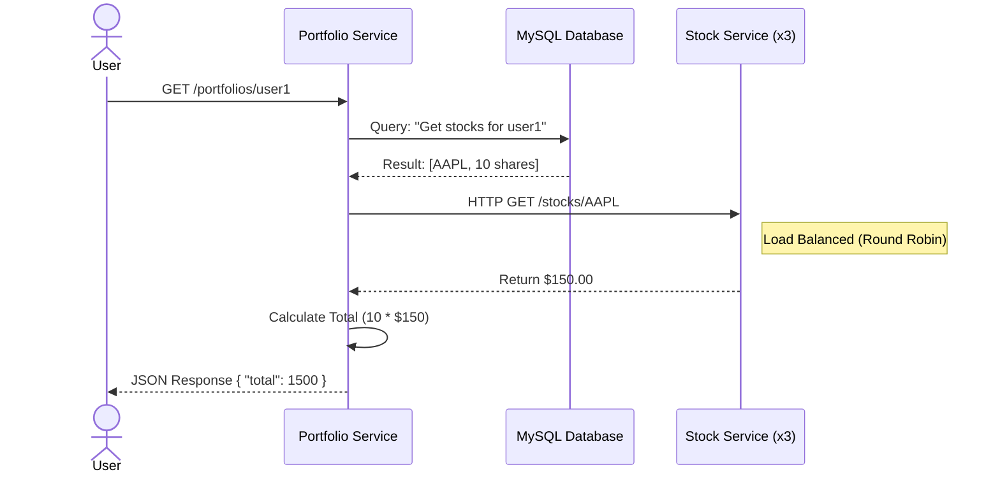

# Distributed Investment Portfolio System 🚀

A cloud-native microservices application for managing stock portfolios, built with Java Spring Boot and orchestrated on Kubernetes.

## 🏗 Architecture
* **Stock Service:** A RESTful microservice acting as the "source of truth" for real-time stock prices. Scaled to 3 replicas for High Availability.
* **Portfolio Service:** A user-facing service that aggregates data from the Database and the Stock Service to calculate total portfolio value.
* **MySQL Database:** Persistent storage for user portfolio data, deployed as a StatefulSet in Kubernetes.

## 🛠 Tech Stack
* **Language:** Java 21, Spring Boot 4.0
* **Containerization:** Docker
* **Orchestration:** Kubernetes (Deployments, Services, Secrets)
* **Database:** MySQL
* **Service Communication:** REST (Feign Client)
* **Service Discovery:** Kubernetes Native Service Discovery (DNS)

## 🚀 How to Run Locally

### Prerequisites
* Docker Desktop (with Kubernetes enabled)
* Java 21
* Maven

### Steps
1.  **Build the Services:**
    ```bash
    cd stock-service && ./mvnw clean package && docker build -t stock-service:v1 .
    cd ../portfolio-service && ./mvnw clean package && docker build -t portfolio-service:v1 .
    ```

2.  **Deploy to Kubernetes:**
    ```bash
    kubectl apply -f k8s/
    ```

3.  **Access the Application:**
    The Portfolio Service is exposed on LoadBalancer.
    * **GET Portfolio:** `http://localhost/portfolios/user1`
    * **POST Trade:** `curl -X POST -H "Content-Type: application/json" -d '{"symbol":"AAPL","quantity":10,"userId":"user1"}' http://localhost/portfolios/user1`

## 📈 Scalability
The system implements **Client-Side Load Balancing** via Kubernetes Services. The Stock Service is configured to run with **3 Replicas**, ensuring zero downtime during updates or random pod failures.

## 🔄 Request Flow Architecture
The following diagram illustrates how a user request is processed across the microservices:


